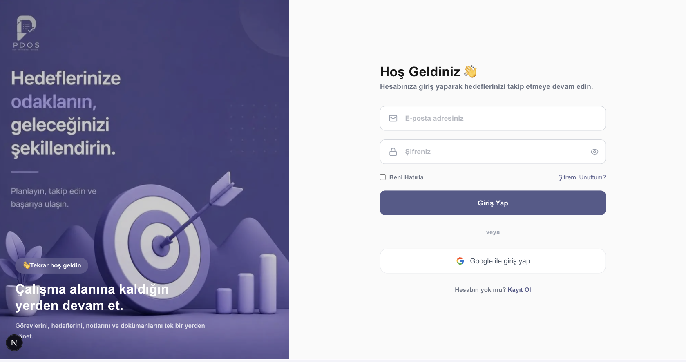
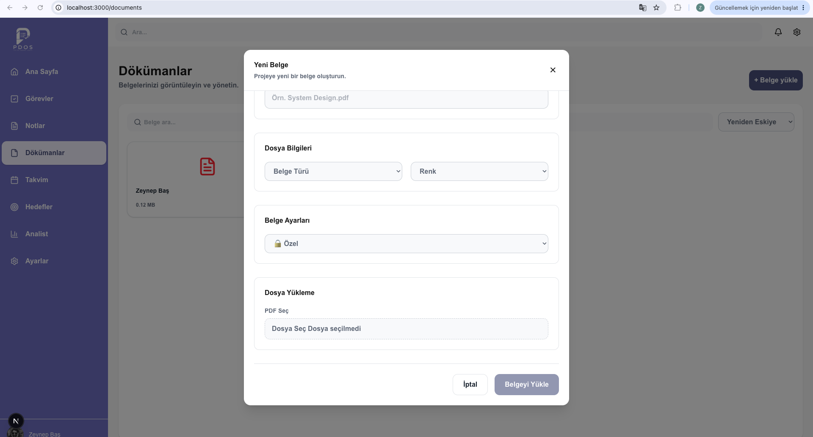

# PDOS — Personal Data Operating System

PDOS (Personal Data Operating System), görevleri, notları, hedefleri, dokümanları ve günlük aktiviteleri tek bir platform üzerinden yönetmek için geliştirilmiş kişisel çalışma ve verimlilik uygulamasıdır.

Proje; modern frontend mimarileri, temiz kod prensipleri, component-driven development ve ölçeklenebilir bir uygulama yapısı üzerine kurulmuştur.

---

## 🚀 Version 1

PDOS Version 1 kapsamında uygulamanın temel kullanıcı, görev, not, hedef, doküman, takvim ve analiz özellikleri tamamlanmıştır.

### Version 1 Durumu

- [x] Login
- [x] Register
- [x] Forgot Password
- [x] Profil Ayarları
- [x] Kullanıcı Rolleri
- [x] Task Management
- [x] Kanban Board
- [x] Task Detail
- [x] Calendar
- [x] Notes
- [x] Goals
- [x] Documents
- [x] Analytics
- [x] Admin / User yetkilendirme yapısı
- [x] Task paylaşımı
- [x] Document paylaşımı
- [x] Notes paylaşımı
- [x] Goals paylaşımı
- [x] Dashboard istatistikleri
- [x] Gün / Ay / Yıl filtreleme
- [ ] Protected Route

> Version 1'in tamamlanması için yalnızca Protected Route yapısının sonlandırılması planlanmaktadır.

---

# 📌 Özellikler

## 🔐 Authentication

Kullanıcıların platforma güvenli şekilde erişebilmesi için temel authentication akışları oluşturulmuştur.

- Login
- Register
- Forgot Password
- Profil Ayarları
- Kullanıcı Rolleri

Authentication sonrasında kullanıcıların sahip olduğu role göre erişebileceği alanlar kontrol edilmektedir.

---

# 👥 Kullanıcı ve Rol Sistemi

PDOS içerisinde temel olarak iki farklı kullanıcı rolü bulunmaktadır:

### Admin

Admin sistem içerisinde daha geniş yetkilere sahiptir.

Admin:

- Task oluşturabilir
- Task'ları kullanıcılara atayabilir
- Task paylaşabilir
- Kullanıcıları yönetebilir
- Tablo görünümünü kullanabilir
- Doküman paylaşabilir
- Paylaşılan dokümanları yönetebilir

### User

Normal kullanıcı kendi çalışma alanını yönetebilir.

Kullanıcı:

- Kendisine atanan task'ları görebilir
- Kanban alanını kullanabilir
- Kendi task'larını takip edebilir
- Notes oluşturabilir
- Notes paylaşabilir
- Notes silebilir
- Goals oluşturabilir
- Goals düzenleyebilir
- Calendar üzerinden kendisine atanmış task'ları görebilir
- Analytics alanından kendi task analizlerini takip edebilir
- Kendi dokümanlarını yönetebilir

---

🛠️ Tech Stack
Frontend
Next.js 14
React
JavaScript
Tailwind CSS
Data Management
TanStack Query
Axios
Custom Hooks
Architecture & Design Patterns
Clean Architecture
Feature Based Architecture
Component Driven Development
Adapter Pattern
Repository Pattern
Provider Pattern
Singleton Pattern
Performance & Rendering
SSR
CSR
Lazy Loading
Streaming
Virtualization
Application Features
Authentication
Role Based Authorization
Kanban
Calendar
Analytics
Notes
Goals
Documents
Dashboard

## 🔮 Version 2

Version 2 kapsamında öncelikli olarak authentication ve authorization altyapısının route seviyesinde güçlendirilmesi planlanmaktadır.

 Protected Route
 Role Based Route Protection
 Yetkisiz kullanıcıların protected sayfalara erişiminin engellenmesi
 Authentication state'in route seviyesinde kontrol edilmesi
 Sayfaların rollere göre ayrılması
 
---

## Kurulum ve Çalıştırma

### Hızlı kurulum scripti

#### Windows (PowerShell)

Proje kök dizininde PowerShell açıp çalıştırın:

```powershell
powershell -ExecutionPolicy Bypass -File .\start.ps1
```

Yeniden kurulum için:

```powershell
powershell -ExecutionPolicy Bypass -File .\start.ps1 -Reinstall
```

`ExecutionPolicy Bypass` yalnızca bu komutla başlatılan süreç için geçerlidir ve sistem genelindeki PowerShell politikasını değiştirmez.

#### Linux, macOS, WSL veya Git Bash

Proje kök dizininden aşağıdaki komutu çalıştırın:

```bash
bash ./start.sh
```

Script:

- `npm` ve Node.js'in kurulu olup olmadığını kontrol eder.
- Backend ve frontend paketlerini ayrı ayrı kurar.
- MongoDB bağlantı adresini, backend portunu, frontend portunu ve frontend API adresini sorar.
- Sorularda Enter'a basıldığında ekranda gösterilen varsayılan değerleri kullanır.
- Güvenli ve rastgele bir JWT anahtarı üretip ortam dosyasına yazar.
- Kurulum sonunda uygulamanın çalıştırılıp çalıştırılmayacağını sorar.
- Frontend veya backend portu doluysa ilgili süreci gösterir; süreci kapatmayı veya boş bir alternatif port seçmeyi teklif eder.
- Seçilen alternatif portu `.env` dosyalarına kaydeder; backend portu değişirse frontend API adresini de günceller.
- Proje daha önce kurulmuşsa paket kurulumu ve yapılandırma sorularını atlar.

Bağımlılıkları ve ortam ayarlarını yeniden kurmak için:

```bash
bash ./start.sh --reinstall
```

> `--reinstall`, mevcut `client/.env` ve `server/.env` dosyalarını girilen yeni değerlerle yeniden oluşturur ve yeni bir JWT anahtarı üretir.

PowerShell sürümündeki `-Reinstall` seçeneği de aynı işlemi gerçekleştirir.

### Gereksinimler

- Node.js 20.9 veya üzeri
- npm
- Çalışan bir MongoDB sunucusu (yerel kurulum veya MongoDB Atlas)

Uygulama iki ayrı süreçten oluşur: `client` dizinindeki Next.js arayüzü ve `server` dizinindeki Express API'si. Bu nedenle bağımlılıklar iki dizinde ayrı ayrı kurulmalı ve geliştirme sırasında iki terminal kullanılmalıdır.

### 1. Depoyu hazırlayın

```bash
git clone <depo-adresi>
cd personal-data-operating-system
```

Backend bağımlılıklarını kurun:

```bash
cd server
npm install
```

Frontend bağımlılıklarını kurun:

```bash
cd ../client
npm install
```

### 2. Ortam değişkenlerini ayarlayın

`server/.env.example` dosyasını `server/.env` adıyla kopyalayın ve değerleri doldurun:

```env
PORT=6021
MONGO_URI=mongodb://127.0.0.1:27017/pdos
JWT_SECRET=guclu-ve-gizli-bir-anahtar
```

`client/.env.example` dosyasını `client/.env` adıyla kopyalayın ve API adresini tanımlayın:

```env
NEXT_PUBLIC_API_URI=http://localhost:6021/api
```

> Not: Mevcut `client/.env.example` dosyasındaki değişken adı uygulama koduyla uyuşmamaktadır. İstemci kodu `NEXT_PUBLIC_API_URI` değişkenini kullanır.

### 3. Geliştirme ortamını çalıştırın

İlk terminalde backend'i başlatın:

```bash
cd server
npm run dev
```

İkinci terminalde frontend'i başlatın:

```bash
cd client
npm run dev
```

Ardından tarayıcıda `http://localhost:3000` adresini açın. API varsayılan olarak `http://localhost:6021` adresinde çalışır.

### Production çalıştırma

Backend'i başlatın:

```bash
cd server
npm start
```

Frontend'i derleyip başlatın:

```bash
cd client
npm run build
npm start
```

# PDOS Görselleri

## Login



## Calendar


## Notes


## Document



## Tasks Kanban


## Tasks Create


## Dashboard


## Analytics


## Goals


