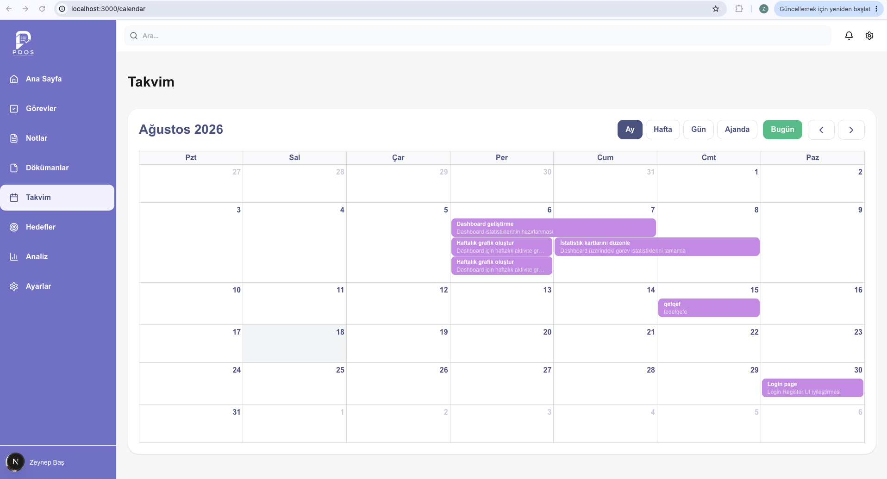
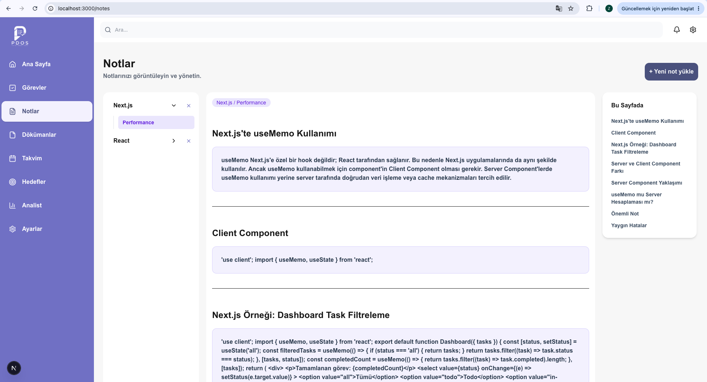
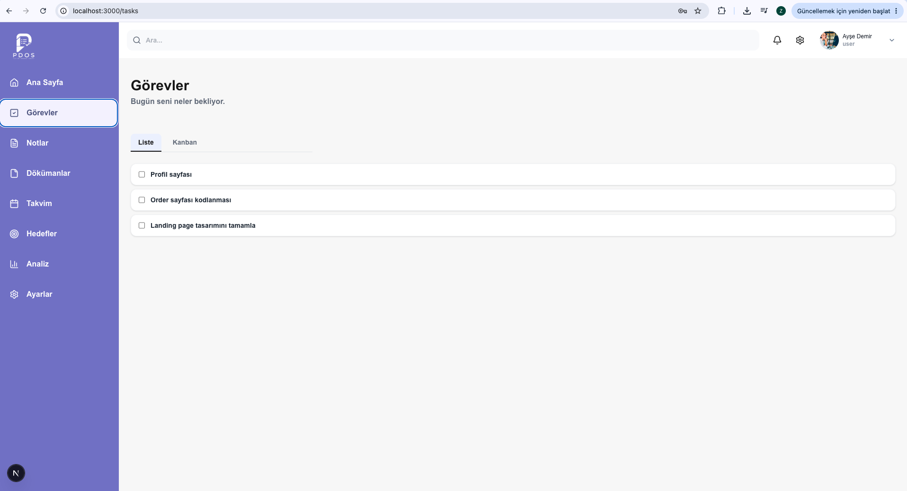
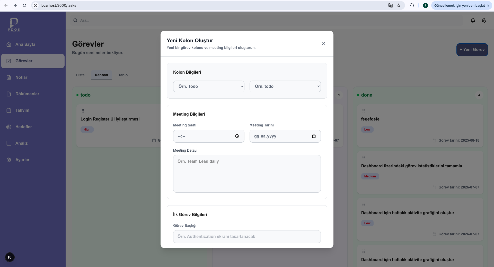
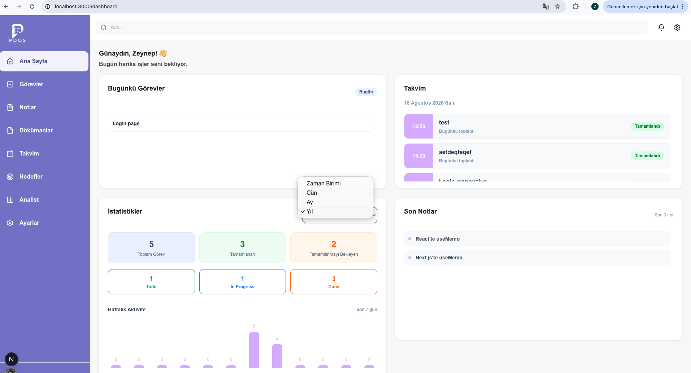
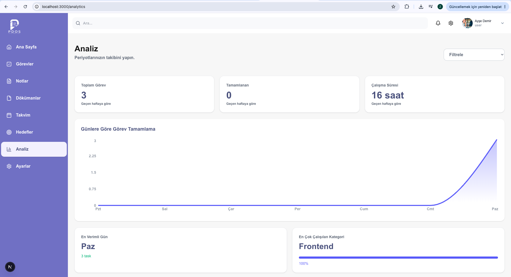
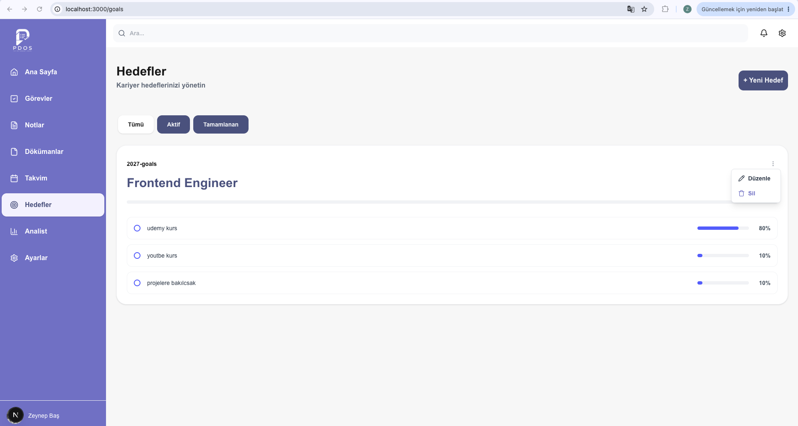

# PDOS — Personal Data Operating System

PDOS (Personal Data Operating System), görevleri, notları, hedefleri, dokümanları ve günlük aktiviteleri tek bir platform üzerinden yönetmek için geliştirilmiş kişisel çalışma ve verimlilik uygulamasıdır.

Proje; modern frontend mimarileri, temiz kod prensipleri, component-driven development ve ölçeklenebilir bir uygulama yapısı üzerine kurulmuştur.

---

## 🚀 Version 1

PDOS Version 1 kapsamında uygulamanın temel kullanıcı, görev, not, hedef, doküman, takvim ve analiz özellikleri tamamlanmıştır.

### Version 1 Durumu

- [x] Login
- [x] Register
- [x] Forgot Password
- [x] Profil Ayarları
- [x] Kullanıcı Rolleri
- [x] Task Management
- [x] Kanban Board
- [x] Task Detail
- [x] Calendar
- [x] Notes
- [x] Goals
- [x] Documents
- [x] Analytics
- [x] Admin / User yetkilendirme yapısı
- [x] Task paylaşımı
- [x] Document paylaşımı
- [x] Notes paylaşımı
- [x] Goals paylaşımı
- [x] Dashboard istatistikleri
- [x] Gün / Ay / Yıl filtreleme
- [ ] Protected Route

> Version 1'in tamamlanması için yalnızca Protected Route yapısının sonlandırılması planlanmaktadır.

---

# 📌 Özellikler

## 🔐 Authentication

Kullanıcıların platforma güvenli şekilde erişebilmesi için temel authentication akışları oluşturulmuştur.

- Login
- Register
- Forgot Password
- Profil Ayarları
- Kullanıcı Rolleri

Authentication sonrasında kullanıcıların sahip olduğu role göre erişebileceği alanlar kontrol edilmektedir.

---

# 👥 Kullanıcı ve Rol Sistemi

PDOS içerisinde temel olarak iki farklı kullanıcı rolü bulunmaktadır:

### Admin

Admin sistem içerisinde daha geniş yetkilere sahiptir.

Admin:

- Task oluşturabilir
- Task'ları kullanıcılara atayabilir
- Task paylaşabilir
- Kullanıcıları yönetebilir
- Tablo görünümünü kullanabilir
- Doküman paylaşabilir
- Paylaşılan dokümanları yönetebilir

### User

Normal kullanıcı kendi çalışma alanını yönetebilir.

Kullanıcı:

- Kendisine atanan task'ları görebilir
- Kanban alanını kullanabilir
- Kendi task'larını takip edebilir
- Notes oluşturabilir
- Notes paylaşabilir
- Notes silebilir
- Goals oluşturabilir
- Goals düzenleyebilir
- Calendar üzerinden kendisine atanmış task'ları görebilir
- Analytics alanından kendi task analizlerini takip edebilir
- Kendi dokümanlarını yönetebilir

---

🛠️ Tech Stack
Frontend
Next.js 14
React
JavaScript
Tailwind CSS
Data Management
TanStack Query
Axios
Custom Hooks
Architecture & Design Patterns
Clean Architecture
Feature Based Architecture
Component Driven Development
Adapter Pattern
Repository Pattern
Provider Pattern
Singleton Pattern
Performance & Rendering
SSR
CSR
Lazy Loading
Streaming
Virtualization
Application Features
Authentication
Role Based Authorization
Kanban
Calendar
Analytics
Notes
Goals
Documents
Dashboard

## 🔮 Version 2

Version 2 kapsamında öncelikli olarak authentication ve authorization altyapısının route seviyesinde güçlendirilmesi planlanmaktadır.

 Protected Route
 Role Based Route Protection
 Yetkisiz kullanıcıların protected sayfalara erişiminin engellenmesi
 Authentication state'in route seviyesinde kontrol edilmesi
 Sayfaların rollere göre ayrılması
---

# PDOS Görselleri

## Login

## Calendar

## Notes

## Tasks Kanban

## Tasks Create

## Dashboard

## Analytics

## Goals

