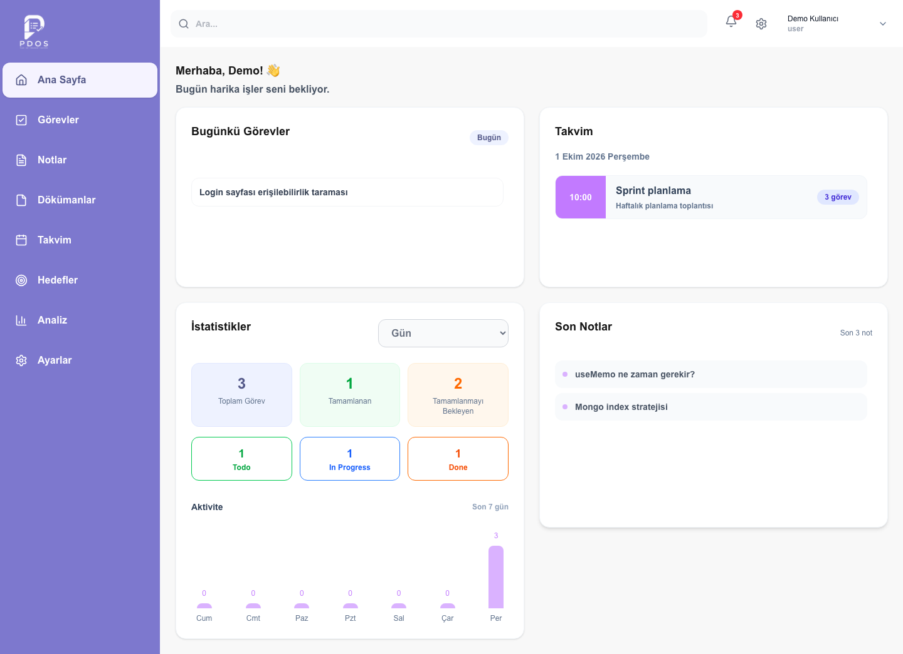
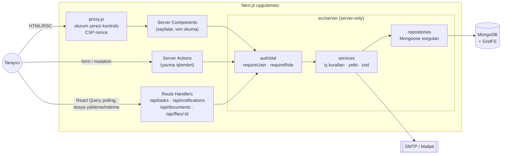
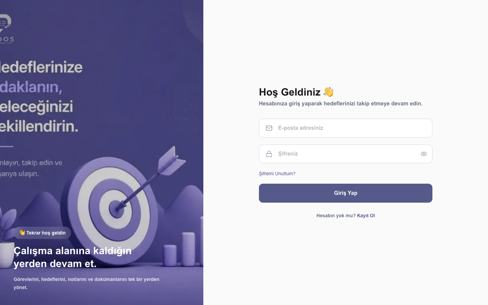
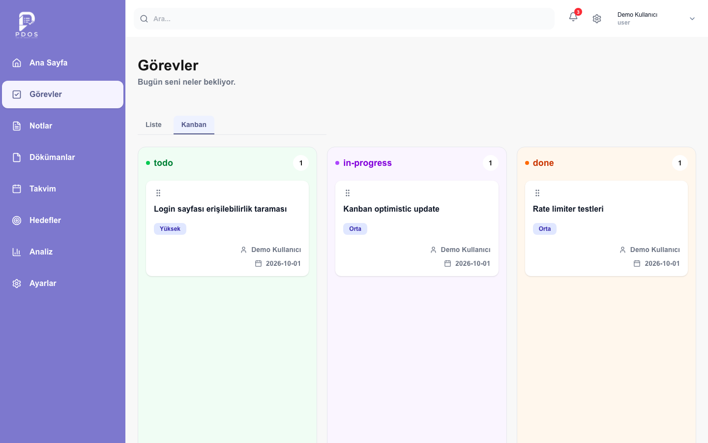
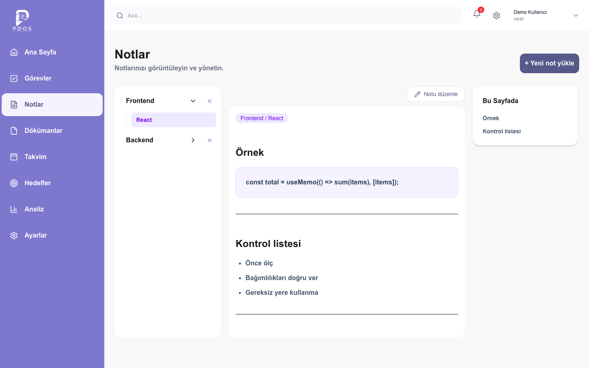
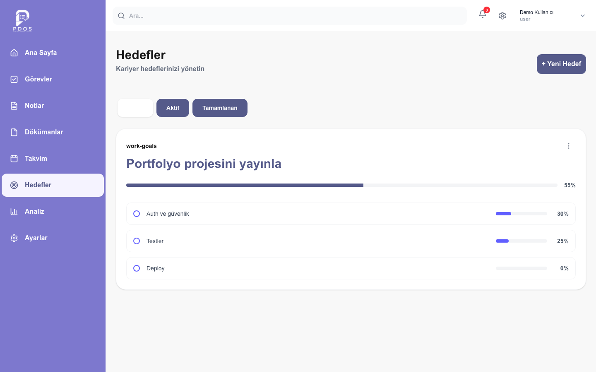
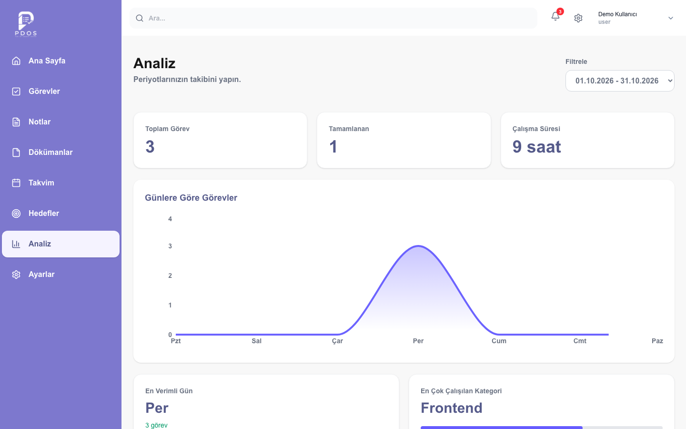
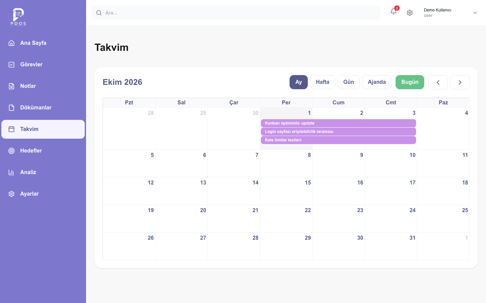

# PDOS — Personal Data Operating System

Görevleri, notları, hedefleri, dokümanları ve toplantıları tek bir çalışma alanında toplayan kişisel/ekip verimlilik uygulaması. Tek bir **Next.js (App Router) full-stack** uygulaması olarak çalışır: arayüz, iş mantığı, dosya depolama ve kimlik doğrulama aynı kod tabanında, ayrı bir API sunucusu olmadan.



## Problem

Kişisel notlar, ekipten gelen görevler, hedef takibi ve dokümanlar genelde farklı araçlara dağılır. PDOS bunları tek bir yerde birleştirir:

- **Admin**, toplantı oluşturup ekip üyelerine görev atar; atanan kişi bildirim alır.
- **Kullanıcı**, kendisine atanan görevleri liste/kanban görünümünde yönetir, sürükle-bırak ile durumunu değiştirir.
- Herkes kendi notlarını (kod, liste, alıntı bölümleriyle), hedeflerini ve PDF dokümanlarını yönetir; admin dokümanları ekiple paylaşabilir.
- Takvim ve analiz ekranları görevleri tarih ve kategoriye göre özetler.

## Mimari


```mermaid
flowchart LR
    Browser((Tarayıcı))

    subgraph Next["Next.js uygulaması"]
        Proxy["proxy.js<br/>oturum çerezi kontrolü<br/>CSP nonce"]
        RSC["Server Components<br/>(sayfalar, veri okuma)"]
        Actions["Server Actions<br/>(yazma işlemleri)"]
        Routes["Route Handlers<br/>/api/tasks · /api/notifications<br/>/api/documents · /api/files/:id"]
        subgraph Server["src/server (server-only)"]
            DAL["auth/dal<br/>requireUser · requireRole"]
            Services["services<br/>iş kuralları · yetki · zod"]
            Repos["repositories<br/>Mongoose sorguları"]
        end
    end

    Mongo[(MongoDB<br/>+ GridFS)]
    Mail[[SMTP / Mailpit]]

    Browser -->|HTML/RSC| Proxy --> RSC
    Browser -->|form / mutation| Actions
    Browser -->|React Query polling,<br/>dosya yükleme/indirme| Routes
    RSC --> DAL
    Actions --> DAL
    Routes --> DAL
    DAL --> Services --> Repos --> Mongo
    Services --> Mail
```

| Katman                | Sorumluluk                                                                                                                                            | Nerede                    |
| --------------------- | ----------------------------------------------------------------------------------------------------------------------------------------------------- | ------------------------- |
| **Server Components** | Sayfa verisini doğrudan service katmanından okur; kendi API'sine HTTP isteği atmaz.                                                                   | `src/app/**/page.js`      |
| **Server Actions**    | Tüm yazma işlemleri. Her çağrıda oturum + yetki kontrolü, zod doğrulaması, `revalidatePath`. Tutarlı `{ ok, data, error, fieldErrors }` sonucu döner. | `src/features/*/actions`  |
| **Route Handlers**    | Yalnızca gerçekten HTTP gereken yerler: dosya yükleme/indirme, React Query'nin poll ettiği canlı listeler.                                            | `src/app/api/**/route.js` |
| **Services**          | İş kuralları, sahiplik (`{ _id, user }`) ve rol kontrolleri, DTO'ya dönüştürme (şifre gibi alanlar asla dışarı çıkmaz).                               | `src/server/services`     |
| **Repositories**      | Mongoose sorguları, cursor tabanlı sayfalama, index'ler.                                                                                              | `src/server/repositories` |
| **Shared schemas**    | Form ile Server Action'ın kullandığı tek kaynak zod şemaları.                                                                                         | `src/shared/schemas`      |

`src/server/**` altındaki her modül `import "server-only"` ile korunur; ek olarak ESLint, component/hook dosyalarının `@/server` import etmesini engeller.

Ayrıntılı gerekçeler için [ADR'lere](docs/adr) bakın.

## Teknoloji seçimleri

| Seçim                                               | Neden                                                                                                                                                                         |
| --------------------------------------------------- | ----------------------------------------------------------------------------------------------------------------------------------------------------------------------------- |
| **Next.js 16 App Router**                           | Server Components + Server Actions ile ayrı bir API katmanı olmadan full-stack; streaming ve `Suspense` ile parçalı yükleme. ([ADR-0001](docs/adr/0001-express-to-nextjs.md)) |
| **JavaScript + zod + JSDoc**                        | TypeScript yerine çalışma zamanında doğrulayan tek kaynak şemalar, JSDoc tipleri ve sınır durumu testleri. ([ADR-0004](docs/adr/0004-javascript-with-zod-and-jsdoc.md))       |
| **Veritabanı tabanlı opak session**                 | Anında iptal, "şifre değişince tüm oturumları kapat", kütüphane bağımlılığı yok. ([ADR-0002](docs/adr/0002-session-strategy.md))                                              |
| **MongoDB + Mongoose + GridFS**                     | Dosyalar da aynı veritabanında; sahiplik kontrolü tek yerde, Docker ve Vercel+Atlas'ta aynı şekilde çalışır. ([ADR-0005](docs/adr/0005-file-storage-gridfs.md))               |
| **React Query (sadece görevler/bildirimler)**       | Kanban sürükle-bırak için optimistic update ve bildirim polling'i. Diğer sayfalar Server Component. ([ADR-0003](docs/adr/0003-server-actions-vs-route-handlers.md))           |
| **react-hook-form + zod**                           | Paylaşılan şemalarla istemci doğrulaması, sunucu alan hatalarının forma geri yansıtılması.                                                                                    |
| **pino**                                            | Yapılandırılmış JSON log; şifre, token ve çerez alanları maskelenir.                                                                                                          |
| **Vitest + mongodb-memory-server, RTL, Playwright** | Service/repository testleri gerçek Mongo ile; UI testleri jsdom'da; uçtan uca akış gerçek tarayıcıda.                                                                         |

## Güvenlik

- **Session:** 32 byte rastgele token yalnızca `httpOnly`, `sameSite=lax`, production'da `secure` ve `__Host-` önekli çerezde; veritabanında sadece SHA-256 özeti tutulur. 7 gün hareketsizlik, 30 gün mutlak ömür. Giriş sonrası her zaman yeni token (session fixation yok). Çıkış token'ı sunucuda siler.
- **Şifre sıfırlama:** Tek kullanımlık, 30 dakika geçerli, veritabanında hash'lenmiş token; e-posta ile bağlantı. Kayıtlı olan/olmayan e-postaya aynı yanıt ve aynı yanıt süresi (`after()` ile). Sıfırlama sonrası tüm oturumlar kapanır.
- **`passwordChangedAt`:** Şifre değiştiğinde öncesinde açılmış oturumlar geçersiz sayılır.
- **Rate limit:** Giriş (IP+e-posta, 5/15 dk), kayıt (5/saat), şifre sıfırlama (3/saat). MongoDB'de atomik sayaç, TTL index ile temizlenir.
- **Yetki:** `proxy.js` sadece hızlı yönlendirme yapar; asıl kontrol her Server Action, Route Handler ve service çağrısında tekrarlanır. Başkasına ait kaynaklar `404` döner (varlık bilgisi sızdırılmaz).
- **Dosyalar:** İçerikten tür tespiti (magic bytes), boyut sınırı, rastgele dosya adı, GridFS'te sahiplik metadata'sı. İndirme yalnızca yetkili Route Handler üzerinden, `nosniff` ve `sandbox` CSP ile.
- **Header'lar:** İstek başına nonce'lu CSP (`strict-dynamic`), `X-Frame-Options: DENY`, `Referrer-Policy`, `Permissions-Policy`, HTTPS'te HSTS. Server Action'lar ve dosya yükleme uç noktası kaynak (Origin) doğrulaması yapar.
- **Veri sızıntısı:** DTO/serializer fonksiyonları yalnızca izin verilen alanları döndürür; hata mesajları istemciye iç ayrıntı taşımaz, log'a gider.

## Kurulum

### Tek komutla (Docker)

```bash
docker compose up --build
```

- Uygulama: http://localhost:3000
- Mailpit (şifre sıfırlama e-postaları): http://localhost:8025
- Açılışta veritabanı migration'ları otomatik çalışır.

Demo verisi (isteğe bağlı):

```bash
docker compose exec app node scripts/seed.mjs
```

| Hesap            | Şifre            | Rol   |
| ---------------- | ---------------- | ----- |
| `admin@pdos.dev` | `admin-demo-123` | admin |
| `demo@pdos.dev`  | `demo-demo-123`  | user  |

> 27017 portu doluysa: `MONGO_PORT=27019 docker compose up --build`.

### Yerel geliştirme

Gereksinimler: Node 22, pnpm 10 (`corepack enable`), Docker.

```bash
pnpm install
cp .env.example .env
docker compose up -d mongo mailpit
pnpm db:migrate
pnpm db:seed        # isteğe bağlı
pnpm dev
```

Ortam değişkenleri `src/server/env.js` içinde zod ile doğrulanır; eksik ya da hatalı bir değişken varsa uygulama hangisi olduğunu söyleyerek açılmaz.

## Testler

```bash
pnpm lint                 # ESLint (next, react-hooks, jsx-a11y, import)
pnpm test                 # Vitest: server (mongodb-memory-server) + ui (jsdom)
pnpm test:coverage        # kapsam raporu → coverage/
pnpm test:e2e             # Playwright; önce docker compose up
```

| Seviye             | Kapsam                                                                                                                        |
| ------------------ | ----------------------------------------------------------------------------------------------------------------------------- |
| Service/repository | Auth akışları, sahiplik (başkasının kaynağına erişim reddi), validation, null/yanlış tip/eksik alan, sayfalama, migration'lar |
| Entegrasyon        | Server Action'lar (çerez, yönlendirme, rate limit) ve Route Handler'lar (401, 403, dosya yükleme)                             |
| Component          | Login formu, not/hedef formları, erişilebilir modal                                                                           |
| E2E                | kayıt → giriş → not oluştur/düzenle → görevi kanban'da taşı → PDF yükle → şifreyi e-postayla sıfırla → çıkış                  |

Service katmanı satır kapsamı %96, auth katmanı %90'ın üzerindedir.

CI (`.github/workflows/ci.yml`) her PR'da lint → format → test (+kapsam) → build, ardından Docker üzerinde Playwright ve Lighthouse CI çalıştırır.

## Performans ve erişilebilirlik

Lighthouse (masaüstü, 3 çalıştırmanın medyanı), eski sürüm (`9e393c4`) ile karşılaştırma:

| Sayfa       | Metrik            | Önce   | Sonra  |
| ----------- | ----------------- | ------ | ------ |
| `/login`    | Performance       | 100    | 100    |
|             | Accessibility     | 88     | 96     |
|             | Best practices    | 96     | 96     |
|             | SEO               | 82     | 92     |
|             | LCP               | 607 ms | 747 ms |
|             | Script (transfer) | 232 KB | 333 KB |
| `/register` | Accessibility     | 88     | 96     |
|             | SEO               | 82     | 92     |
|             | Script (transfer) | 230 KB | 325 KB |

JS artışının kaynağı, formların sunucuyla aynı zod şemasını istemcide de çalıştırmasıdır (zod + react-hook-form ≈ 100 KB). Bu bilinçli bir trade-off; azaltma seçeneği olarak `zod/mini`'ye geçiş [ADR-0004](docs/adr/0004-javascript-with-zod-and-jsdoc.md)'te değerlendirildi. Giriş yapılmış alanda FullCalendar, Recharts ve sürükle-bırak kütüphanesi `next/dynamic` ile yalnızca ihtiyaç anında yüklenir; dashboard ve analiz sayfaları `Suspense` ile akış halinde render edilir.

Bundle analizi: `pnpm analyze` (Turbopack uyumlu `next experimental-analyze`; webpack tabanlı `@next/bundle-analyzer` Turbopack ile çalışmadığı için tercih edilmedi).

## Deploy

- **Docker:** `Dockerfile` çok aşamalı ve `output: "standalone"` kullanır; imaj açılışta migration'ları çalıştırır ve `/api/health` ile sağlık kontrolü yapar. Herhangi bir container platformunda MongoDB Atlas ile çalışır.
- **Vercel:** Dosyalar GridFS'te tutulduğu için kalıcı disk gerekmez. `MONGODB_URI`, `APP_URL`, `SMTP_*`, `MAIL_FROM` ortam değişkenlerini tanımlayın ve deploy öncesi `pnpm db:migrate` çalıştırın.

Canlı demo bağlantısı deploy sonrası buraya eklenecek.

## Proje yapısı

```
src/
  app/                 route'lar (Server Components), layout'lar, Route Handlers
  features/<feature>/  actions (Server Actions), components, hooks, utils
  server/              server-only: auth, db, models, repositories, services
  shared/              atom/molekül/organizma component'ler, zod şemaları, yardımcılar
  proxy.js             oturum yönlendirmesi + CSP
scripts/               migration ve demo seed
tests/                 test kurulumu, entegrasyon testleri
e2e/                   Playwright senaryoları
docs/adr/              mimari karar kayıtları
```

## Ekran görüntüleri

|                                           |                                              |
| ----------------------------------------- | -------------------------------------------- |
|       |  |
|      |       |
|  |      |

## Lisans

MIT — bkz. [LICENCE](LICENCE).
